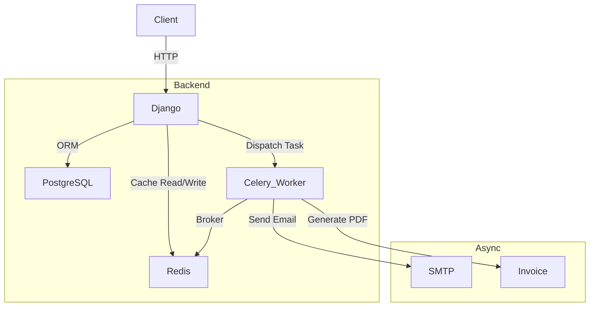
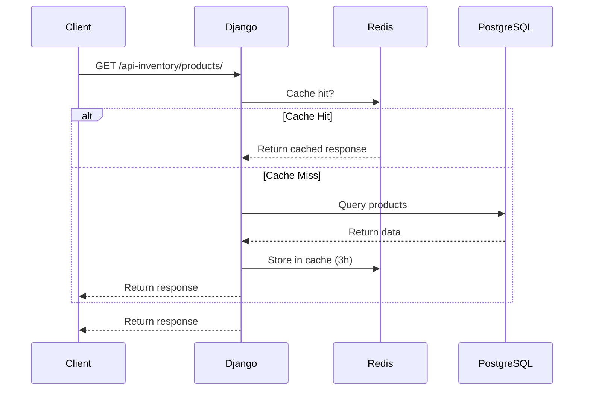

# Inventory & Sales Management — Backend

Django REST API for managing inventory, sales, customers, suppliers, and analytics. JWT auth, async task processing, and Redis caching included.

---

## Stack

- **Django 6** + Django REST Framework
- **PostgreSQL** — primary database
- **Redis** — cache + Celery broker
- **Celery** — async background tasks
- **Docker / Docker Compose**

---

## Architecture



---

## Request Lifecycle (with caching)



---

## API Endpoints

### Auth (`/api/`)

| Method | Endpoint           | Description                           |
| ------ | ------------------ | ------------------------------------- |
| POST   | `/api/login/`      | Login, returns JWT in HttpOnly cookie |
| POST   | `/api/logout/`     | Logout, clears cookies                |
| POST   | `/api/refresh/`    | Refresh access token                  |
| GET    | `/api/check-auth/` | Verify authentication status          |
| GET    | `/api/users/`      | List / manage users                   |

### Inventory (`/api-inventory/`)

| Method         | Endpoint                             | Description                   |
| -------------- | ------------------------------------ | ----------------------------- |
| GET/POST       | `/api-inventory/category/`           | List / create categories      |
| GET/PUT/DELETE | `/api-inventory/category/{id}/`      | Category detail               |
| GET/POST       | `/api-inventory/products/`           | List / create products        |
| GET/PUT/DELETE | `/api-inventory/products/{id}/`      | Product detail                |
| GET            | `/api-inventory/products/{id}/sale/` | Sales for a product           |
| GET/POST       | `/api-inventory/supplier/`           | List / create suppliers       |
| GET/PUT/DELETE | `/api-inventory/supplier/{id}/`      | Supplier detail               |
| GET/POST       | `/api-inventory/stockmovement/`      | List / create stock movements |

### Sales (`/api-sales/`)

| Method         | Endpoint                                  | Description              |
| -------------- | ----------------------------------------- | ------------------------ |
| GET/POST       | `/api-sales/customers/`                   | List / create customers  |
| GET/PUT/DELETE | `/api-sales/customers/{id}/`              | Customer detail          |
| GET/POST       | `/api-sales/sales/`                       | List / create sales      |
| GET/PUT/DELETE | `/api-sales/sales/{id}/`                  | Sale detail              |
| GET            | `/api-sales/sales/{id}/download-invoice/` | Download PDF invoice     |
| GET/POST       | `/api-sales/salesitem/`                   | List / create sale items |

### Dashboard (`/api-dashboard/`)

| Method | Endpoint                               | Description                           |
| ------ | -------------------------------------- | ------------------------------------- |
| GET    | `/api-dashboard/`                      | Overall stats (revenue, profit, etc.) |
| GET    | `/api-dashboard/trends/`               | Sales / customer trends               |
| GET    | `/api-dashboard/revenue-profit-chart/` | Revenue & profit chart data           |
| GET    | `/api-dashboard/sales-report/`         | Export sales as CSV                   |
| GET    | `/api-dashboard/stock-movement/`       | Export stock movements as CSV         |

All endpoints support `?period=` query param (`7days`, `30days`, `12months`, etc.)

---

## Celery — Async Tasks

Celery runs as a separate worker service using Redis as the broker.

### Tasks

| Task                          | Trigger                          | What it does                                                  |
| ----------------------------- | -------------------------------- | ------------------------------------------------------------- |
| `send_invoice_email_manually` | Sale created or marked completed | Generates a PDF invoice and emails it to the customer         |
| `send_low_stock_email`        | Sale item created                | Checks if stock is below threshold and emails all admin users |

### Why Celery?

Without Celery, sending emails and generating PDFs would block the API response, making it slow for the user. By dispatching these as background tasks:

- API responds immediately
- Emails and PDFs are handled asynchronously
- Tasks can be retried on failure

Tasks are dispatched via Django signals using `transaction.on_commit` to ensure they only fire after the database transaction is committed — avoiding race conditions.

---

## Caching

Redis is used for response caching on list endpoints via Django's `cache_page` decorator.

| Endpoint                       | Cache Duration | Cache Key Prefix |
| ------------------------------ | -------------- | ---------------- |
| `GET /api-inventory/category/` | 2 hours        | `categories`     |
| `GET /api-inventory/products/` | 3 hours        | `products`       |
| `GET /api-inventory/supplier/` | 3 hours        | `suppliers`      |
| `GET /api-sales/customers/`    | 3 hours        | `customers`      |

Cache is **automatically invalidated** on any create, update, or delete via Django signals using `cache.delete_pattern(...)`.

### Why Cache?

These list endpoints are read-heavy and rarely change. Caching them reduces repeated database queries and significantly lowers response times under load.

---

## Running with Docker

```sh
# Start all services (postgres, redis, backend, celery worker)
docker compose up --build

# Run migrations and seed sample data
docker compose exec backend python manage.py migrate
docker compose exec backend python manage.py populate_db
```

### Services

| Service         | Description                        |
| --------------- | ---------------------------------- |
| `postgres`      | PostgreSQL 15 database             |
| `redis`         | Redis 7 — cache and Celery broker  |
| `backend`       | Django API server                  |
| `celery_worker` | Celery worker for background tasks |

---

## Environment Variables

```env
SECRET_KEY=
DEBUG=True

POSTGRES_DB=
POSTGRES_USER=
POSTGRES_PASSWORD=
POSTGRES_HOST=postgres
POSTGRES_PORT=5432

REDIS_HOST=redis
REDIS_PORT=6379

EMAIL_HOST_USER=
EMAIL_HOST_PASSWORD=
DEFAULT_FROM_EMAIL=
```

---

## Auth

JWT-based authentication using `djangorestframework-simplejwt`. Tokens are stored in **HttpOnly cookies** for security. A custom `CookieJWTAuthentication` class reads the token from the cookie on each request.

User roles: `admin`, `manager`, `staff`

---

## License

MIT
